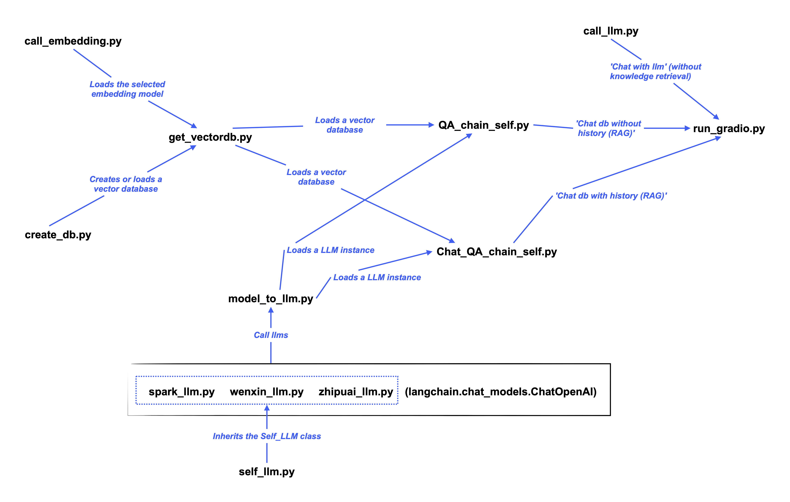

# Reproduction for Personal Knowledge Base Assistant (RAG)


## **Modifications & Enhancements**


This project includes several modifications and improvements based on [the original repository](https://github.com/logan-zou/Chat_with_Datawhale_langchain):

- **Refined Environment Setup**: Additional configurations and corrections were made.
- **Added 'Project Structure'**: Added an overview of all scripts and their relationships.
- **Code Organization & Documentation**: Cleaned up unnecessary codes and added detailed comments.
- **New Features**:
  1. If a vector database already exists in the specified persist path, newly uploaded files will be vectorized and **merged** with the existing vector database. (In the original project, the existing vector database would be replaced.)
  2. The UI now allows users to view and modify the persist path for storing the vector database.

---

## **Environment Setup**

**1️⃣ Create and activate the Conda environment**

```bash
conda create -n llm-universe python==3.9.0
conda activate llm-universe
```


**2️⃣ Modify package versions in `requirements.txt`**

Update the following package versions in `requirements.txt` ([reference](https://zhuanlan.zhihu.com/p/694891334)):
```
langchain
langsmith==0.1.0
langchain-community==0.0.31
packaging
tiktoken
sentence-transformers
```


**3️⃣ Install dependencies**

```bash
pip install -r requirements.txt
```

If you encounter the following error:
```
RuntimeError: Unsupported compiler -- at least C++11 support is needed!
```
It indicates that the C++ compiler (`g++`) is either missing or outdated. You can verify this by running:
```bash
g++ --version
```

For restricted HPC environments (like Triton) where `g++` installation is not allowed, you can switch to an environment that includes `g++` by using:
```bash
module load gcc
```

Then reinstall dependencies.


---

## **Getting Started**

**1️⃣ Activate the environment and navigate to the `serve` directory**

```bash
conda activate llm-universe
cd Chat_with_Datawhale_langchain/serve
```

**2️⃣ Add your API Key to `.env`**

Make sure to add your API Key inside the `.env` file before running.


**3️⃣ Run the Gradio frontend**

```bash
python run_gradio.py
```

---

## **Project Structure**

```
Chat_with_Datawhale_langchain/
    ├── requirements.txt 
    ├── README.md 
    ├── .env  # Stores API keys
    ├── figures/  # Images required for the UI interface
    ├── knowledge_db/  # Knowledge base files
    ├── vector_db/  # Vector database (Chroma)
    ├── serve/
    │   ├──── run_gradio.py  # Gradio-based interactive web UI for LLM applications
    ├── database/ 
    │   ├──── create_db.py  # Indexing (document loading → splitting → embedding → storing in the database)
    │   ├──── test_get_all_repo.py  # Fetches README files of all open-source projects from Datawhale
    │   ├──── text_summary_readme.py  # Generates summaries from fetched README files as part of the knowledge base
    │   ├──── readme_db/  # Stores README files fetched from GitHub via test_get_all_repo.py
    ├── embedding/
    │   ├──── call_embedding.py  # Loads the selected embedding model
    │   ├──── zhipuai_embedding.py  # Loads zhipuai_embedding model
    ├── llm/
    │   ├──── call_llm.py  # Implements 'Chat with LLM' — without knowledge retrieval
    │   ├──── self_llm.py  # Custom Self_LLM class for standardizing API calls across different LLMs.
    │   ├──── spark_llm.py  # Wraps the Spark API
    │   ├──── wenxin_llm.py  # Wraps the Wenxin API
    │   ├──── zhipuai_llm.py  # Wraps the Zhipuai API
    ├── qa_chain/
    │   ├──── get_vectordb.py  # Creates or loads a vector database
    │   ├──── model_to_llm.py  # Instantiates an LLM based on the model parameter
    │   ├──── QA_chain_self.py  # A retrieval-augmented QA chain without conversation history
    │   ├──── Chat_QA_chain_self.py  # A retrieval-augmented conversational QA chain with history
```

<p align="center">
  
</p>

